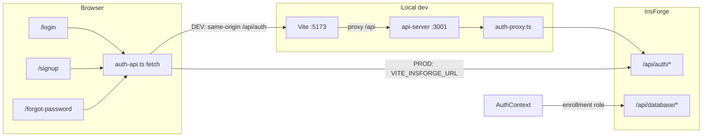

# LISTA Auth Baseline (Login · Sign Up · Reset Password)

**Baseline ID:** `AUTH-BASELINE-2026-05-19`  
**Status:** Verified working in local dev (Vite `:5173` + api-server `:3001` → InsForge)  
**InsForge project:** `https://2r6c3q25.ap-southeast.insforge.app`

Use this document to find every file involved in auth, understand the request path, and restore a known-good version if a future change breaks login, sign up, or password reset.

---

## 1. Snapshot before you change auth again

Auth fixes may still be **uncommitted** in your working tree. Before editing auth, create a restore point:

```powershell
cd c:\Users\PC\Documents\LISTA

# Optional: commit current working auth stack
git add artifacts/lista/src/lib/auth-api.ts `
        artifacts/lista/src/context/auth-context.tsx `
        artifacts/lista/src/pages/public/login.tsx `
        artifacts/lista/src/pages/public/signup.tsx `
        artifacts/lista/src/pages/public/forgot-password.tsx `
        artifacts/lista/src/hooks/use-verification-resend-cooldown.ts `
        artifacts/api-server/src/routes/auth-proxy.ts `
        artifacts/api-server/src/routes/index.ts `
        artifacts/lista/vite.config.ts

git commit -m "docs: auth baseline — login, signup, reset via InsForge proxy"

# Tag this commit (use the SHA printed by git)
git tag -a auth-baseline-2026-05-19 -m "Working login/signup/reset + dev auth proxy"
```

**Restore entire baseline later:**

```powershell
git checkout auth-baseline-2026-05-19 -- artifacts/lista/src/lib/auth-api.ts `
  artifacts/lista/src/context/auth-context.tsx `
  artifacts/lista/src/pages/public/login.tsx `
  artifacts/lista/src/pages/public/signup.tsx `
  artifacts/lista/src/pages/public/forgot-password.tsx `
  artifacts/lista/src/hooks/use-verification-resend-cooldown.ts `
  artifacts/api-server/src/routes/auth-proxy.ts `
  artifacts/api-server/src/routes/index.ts `
  artifacts/lista/vite.config.ts
```

Then rebuild and restart api-server:

```powershell
cd artifacts\api-server
pnpm run build
cd ..\..
pnpm run dev
```

---

## 2. Architecture (dev vs production)



| Environment | Auth HTTP target | Why |
|---------------|------------------|-----|
| **Development** (`import.meta.env.DEV`) | `fetch("/api/auth/...")` → Vite proxy → `localhost:3001` → InsForge | Avoids browser CORS and long direct cross-origin timeouts |
| **Production** | `fetch("${VITE_INSFORGE_URL}/api/auth/...")` | Direct to InsForge from deployed origin |

**Critical dev requirement:** api-server must be running with **`auth-proxy.ts` mounted** at `/api/auth`. If port `3001` serves an old build without the proxy, you get `404 Cannot POST /api/auth/sessions`.

---

## 3. File manifest (restore list)

### Core — do not break without updating this doc

| File | Role |
|------|------|
| `artifacts/lista/src/lib/auth-api.ts` | Shared `authApiUrl`, `authApiRequest`, 25s timeout, user-facing errors |
| `artifacts/lista/src/context/auth-context.tsx` | Session state: `login`, `signUp`, `verifyEmail`, `resendVerificationEmail`, OAuth, logout |
| `artifacts/lista/src/pages/public/login.tsx` | Login UI → `login()` |
| `artifacts/lista/src/pages/public/signup.tsx` | Sign up + OTP verify; existing-account dialog |
| `artifacts/lista/src/pages/public/forgot-password.tsx` | 3-step reset (send code → exchange token → reset) |
| `artifacts/api-server/src/routes/auth-proxy.ts` | Forwards `/api/auth/*` → InsForge |
| `artifacts/api-server/src/routes/index.ts` | `router.use("/auth", authProxyRouter)` |
| `artifacts/lista/vite.config.ts` | `server.proxy["/api"]` → `http://localhost:3001` |

### Supporting

| File | Role |
|------|------|
| `artifacts/lista/src/hooks/use-verification-resend-cooldown.ts` | 60s resend cooldown on sign up (localStorage per email) |
| `artifacts/lista/src/lib/insforge.ts` | InsForge SDK (`lista.from`, OAuth); DB still uses SDK |
| `artifacts/lista/src/lib/auth-token.ts` | Bearer headers for authenticated DB calls |
| `artifacts/lista/src/App.tsx` | Routes: `/login`, `/signup`, `/forgot-password`, `/auth/callback` |
| `artifacts/lista/src/layouts/auth-layout.tsx` | Public auth shell |
| `artifacts/lista/src/pages/public/auth-callback.tsx` | OAuth return handler |
| `artifacts/lista/.env.example` | `VITE_INSFORGE_URL`, `VITE_INSFORGE_ANON_KEY` |

### Post-auth (slow UI fixes — separate from auth HTTP but affects sign-up UX)

| File | Role |
|------|------|
| `artifacts/lista/src/pages/trainee/registration.tsx` | Profile wizard; shows form immediately, cloud hydrate in background |
| `artifacts/lista/src/lib/trainee-enrollment-insforge.ts` | `fetchTraineeEnrollmentByEmail` with 8s timeout |
| `artifacts/lista/src/lib/trainee-registration-state.ts` | `resolveTraineeRegistrationFromCloud` (background after verify) |

---

## 4. InsForge REST endpoints used

All paths use `?client_type=mobile` where noted. Bodies are JSON.

| Flow | Method | Path | Called from |
|------|--------|------|-------------|
| **Log in** | POST | `/api/auth/sessions?client_type=mobile` | `auth-context.login` |
| **Sign up** | POST | `/api/auth/users?client_type=mobile` | `auth-context.signUp` |
| **Send verify code** | POST | `/api/auth/email/send-verification` | `auth-context.resendVerificationEmail`, signup send-code |
| **Verify email (OTP)** | POST | `/api/auth/email/verify?client_type=mobile` | `auth-context.verifyEmail` |
| **Session check** | GET | `/api/auth/sessions/current` | `auth-context` init + logout |
| **Refresh** | POST | `/api/auth/refresh?client_type=mobile` | `auth-context` init |
| **Send reset code** | POST | `/api/auth/email/send-reset-password` | `forgot-password.tsx` |
| **Exchange reset code** | POST | `/api/auth/email/exchange-reset-password-token` | `forgot-password.tsx` |
| **Set new password** | POST | `/api/auth/email/reset-password` | `forgot-password.tsx` |

**InsForge auth settings (verified via MCP):**

- `verifyEmailMethod`: **code** (6-digit OTP)
- `resetPasswordMethod`: **code** (two-step: exchange → reset)
- `requireEmailVerification`: **true**

**OAuth (still SDK):** `lista.auth.signInWithOAuth` in `auth-context` + `auth-callback.tsx`.

---

## 5. User flows (behavior contract)

### Log in (`/login`)

1. User submits email + password.
2. `POST /api/auth/sessions` → session stored in `localStorage` key `lista_session`.
3. `lista.setAccessToken` set; user mapped with role from `public.users` (5s cap) or metadata.
4. Redirect: `?redirect=` safe path, else `getRoleHomePath(role)` → `/trainee` for trainees.

### Sign up (`/signup`)

1. User enters email + password → **Send code**.
2. Fast path: `login()` first — if success, already registered + correct password → signed in.
3. If unverified → resend verification code (60s cooldown).
4. If new → `signUp()` then send verification email.
5. User enters OTP → **Sign Up** → `verifyEmail()` → session created.
6. **Existing email:** `AlertDialog` “Account already registered” → **Go to log in** (`/login?email=...`).
7. Trainee layout redirects to `/trainee/register` if profile incomplete.

### Forgot password (`/forgot-password`)

1. **Send code** → `POST send-reset-password`.
2. User enters OTP + new password → `exchange-reset-password-token` → `reset-password` with `otp: token`.
3. **Done** → link to `/login`.

---

## 6. Graphify queries (code navigation)

> **Note:** `graphify query` may error on edge format in graphify 0.3.27. If it fails, use the file manifest above or ripgrep.

Run from `artifacts/lista` (or repo root if `graphify-out/graph.json` exists):

```powershell
cd c:\Users\PC\Documents\LISTA\artifacts\lista
python -m graphify query "authApiRequest auth-context login signup verifyEmail"
python -m graphify query "auth-proxy forwardAuth api-server /api/auth"
python -m graphify query "forgot-password send-reset-password exchange-reset-password"
python -m graphify path "login.tsx" "auth-api.ts"
python -m graphify explain "auth-context"
```

After auth code edits:

```powershell
python -m graphify update .
```

**Manual grep equivalents:**

```powershell
rg "authApiRequest|authApiUrl" artifacts/lista/src
rg "authProxy|forwardAuth" artifacts/api-server/src
rg "verifyEmail|signUp|login" artifacts/lista/src/context/auth-context.tsx
```

---

## 7. Environment variables

| Variable | Where | Purpose |
|----------|-------|---------|
| `VITE_INSFORGE_URL` | `artifacts/lista/.env`, root `.env` for api-server | InsForge base URL |
| `VITE_INSFORGE_ANON_KEY` | `artifacts/lista/.env` | Public anon key for SDK DB/storage |
| `INSFORGE_URL` | api-server fallback | Same as above for proxy |

---

## 8. Smoke test checklist (5 minutes)

Prerequisites: `pnpm run dev` from repo root; api-server on **3001**; fresh browser or incognito.

| # | Test | Expected |
|---|------|----------|
| 1 | `POST http://localhost:3001/api/auth/sessions?client_type=mobile` with wrong password | **401** (not 404) |
| 2 | Log in with valid trainee | Redirect to `/trainee` or `/trainee/register` |
| 3 | Sign up with **new** email → send code → verify | Session created; no multi-minute spinner |
| 4 | Sign up with **existing** email | Dialog “Account already registered” |
| 5 | Forgot password → code → new password | Success screen; log in with new password |

**404 on `/api/auth/sessions`:** restart dev, rebuild api-server (`cd artifacts/api-server && pnpm run build`).

---

## 9. Common regressions

| Symptom | Likely cause | Fix |
|---------|--------------|-----|
| `Cannot POST /api/auth/sessions` | Stale api-server without proxy | Rebuild + restart; confirm `auth-proxy.ts` in `routes/index.ts` |
| `Failed to fetch` / timeout on login | api-server down or Vite proxy misconfigured | Check `vite.config.ts` `/api` → `3001` |
| Sign up spins forever | Blocking `await` on enrollment in `applySessionPayload` | Restore `auth-context` baseline (background `hydrateTraineeRegistration`) |
| Stuck “Loading Enrollment Data…” | Registration waits on DB before `setIsLoaded` | Restore `registration.tsx` baseline (instant form + background hydrate) |
| Reset fails after code | Wrong REST sequence | Restore `forgot-password.tsx` (exchange token then reset) |
| Direct InsForge from browser in dev | `authApiUrl` not using relative path in DEV | Restore `auth-api.ts` |

---

## 10. Related docs

- `artifacts/lista/docs/PRE-PRODUCTION-CHECKLIST.md` — full trainee journey T1–T10
- `artifacts/lista/docs/E2E-COURSE-APPLICATION-AUDIT.md` — course application flow
- InsForge skill: `.agents/skills/insforge/SKILL.md` — auth SDK reference

---

## 11. Change log (this baseline)

| Date | Change |
|------|--------|
| 2026-05-19 | Dev auth proxy; `auth-api.ts`; forgot-password REST; signup existing-account dialog; non-blocking post-verify hydration; registration instant load + enrollment query timeout |

**Document version:** 1.0 · **Baseline:** `AUTH-BASELINE-2026-05-19`
