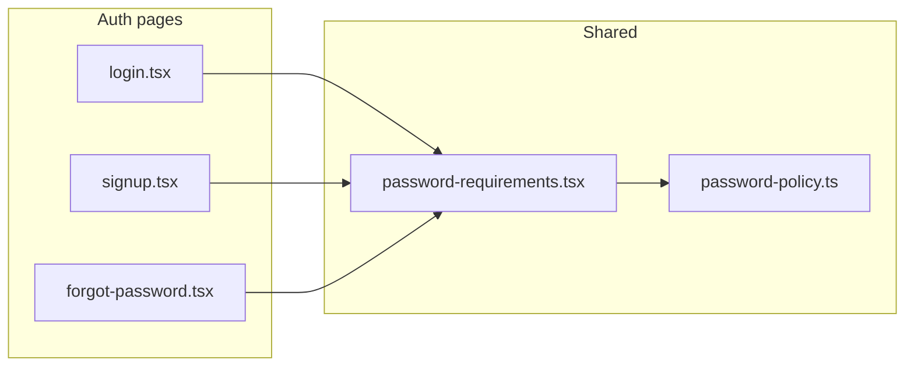

# LISTA — Password Requirements UX Meta-Prompt (End-to-End)

**Goal:** Hide the password requirements checklist until the user starts typing in the password field. Show it as soon as `password.length > 0`, with live pass/fail icons per rule.

**Skills:** `impeccable`, `accessibility`, `frontend-patterns`, `make-interfaces-feel-better`.

**Verify:** `cd artifacts/lista && npm run typecheck`  
**Manual:** `/login`, `/signup`, `/forgot-password` (reset step) — empty password → no grey box; type one character → checklist appears.

---

## Copy-paste agent prompt (full task)

```
You are implementing LISTA auth password-requirements UX: hide the checklist until the user types.

## Problem
On `/login`, `/signup`, and forgot-password reset, the "Password requirements" box (8 chars, upper, lower, number, special) shows while the password field is empty. That adds noise on login (existing passwords) and clutters signup before the user focuses the field.

## Required behavior
| State | UI |
|-------|-----|
| `password === ""` | No requirements box; no extra vertical space |
| `password.length >= 1` | Show checklist; neutral circles → green check / red X per rule as today |
| User clears password | Hide checklist again |

## Files (single source of truth)
| File | Role |
|------|------|
| `src/lib/password-policy.ts` | Rule definitions + `isPasswordValid` / `getPasswordRuleResults` — do not duplicate labels |
| `src/components/password-requirements.tsx` | Renders checklist; `hideUntilTyping` default `true` → return `null` when empty |
| `src/pages/public/login.tsx` | `PasswordRequirements` + conditional `aria-describedby` |
| `src/pages/public/signup.tsx` | Same |
| `src/pages/public/forgot-password.tsx` | Same on **new password** field only |

## Implementation contract

### 1. Component — `password-requirements.tsx`
- Prop: `hideUntilTyping?: boolean` (default `true`).
- Early return: `if (hideUntilTyping && password.length === 0) return null`.
- Export helper:
  `passwordRequirementsDescribedBy(id, password, hideUntilTyping?)`
  → returns `undefined` when checklist hidden, else `id`.

### 2. Parents — password input a11y
- Replace static `aria-describedby="…-password-requirements"` with:
  `aria-describedby={passwordRequirementsDescribedBy("…-password-requirements", password)}`
- Do not reference a DOM id that is not mounted (screen readers would point at nothing).

### 3. Login page note
Login still mounts `PasswordRequirements` for consistency (policy hints if user experiments with password). Validation on submit remains email+password required only — requirements UI is informational on login, not a gate.

### 4. Signup / reset
Submit validation must still use `isPasswordValid(password)` from `password-policy.ts` regardless of checklist visibility.

## Accessibility
- Checklist: `role="group"`, `aria-label="Password requirements"`, `aria-live="polite"` on the list.
- Hidden checklist ⇒ no `aria-describedby` on the input.
- Visible checklist ⇒ `aria-describedby` matches checklist `id`.

## Out of scope
- Changing rule text or InsForge server policy
- Showing requirements on confirm-password fields
- Animating show/hide (optional later; not required)

## Acceptance checklist
- [ ] `/login` — fresh load, password empty: no requirements box under password
- [ ] Type one character: box appears with rules updating live
- [ ] Delete all characters: box disappears
- [ ] `/signup` and forgot-password reset: same behavior
- [ ] `npm run typecheck` passes
```

---

## Architecture (reference)



---

## Rule copy (from `password-policy.ts`)

1. Minimum 8 characters  
2. At least 1 uppercase letter  
3. At least 1 lowercase letter  
4. At least 1 number  
5. At least 1 special character (`@$!%*?&`)

---

## Regression risks

| Risk | Mitigation |
|------|------------|
| Orphan `aria-describedby` | Use `passwordRequirementsDescribedBy` helper |
| Signup allows weak password | Keep `isPasswordValid` in submit handler |
| Layout shift when box appears | Accept minor shift on first keystroke; optional future: `animate-in` on container |

---

*Last updated: implementation in `password-requirements.tsx` + login/signup/forgot-password.*
